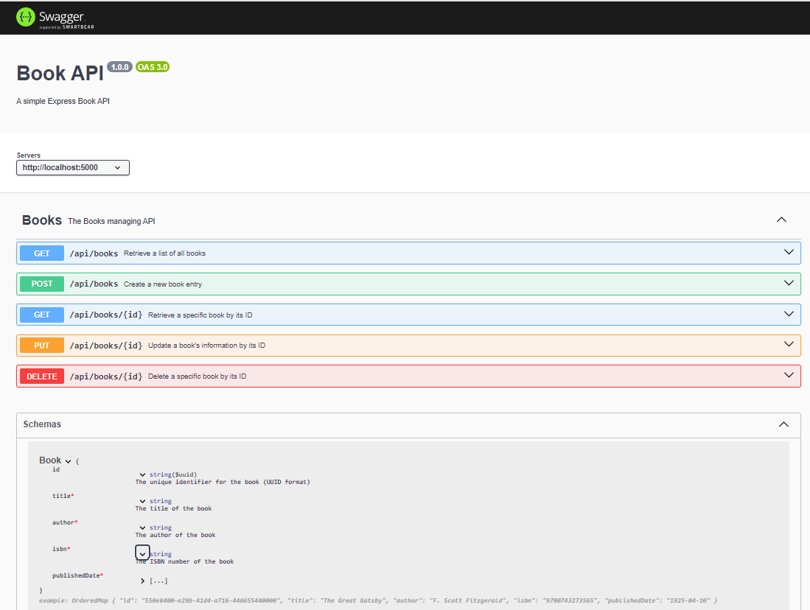

# Book API

A RESTful API for managing books, built using Node.js, Express, and MongoDB. This application allows users to perform CRUD operations on a book dataset. Swagger is used for API documentation.



## Table of Contents

1. [Installation](#installation)
2. [Swagger Documentation](#swagger-documentation)
3. [Usage](#usage)
4. [API Endpoints](#api-endpoints)
5. [Data Schema](#data-schema)
6. [Features](#features)
7. [Testing](#testing)
8. [License](#license)

## Installation

1. **Clone the repository:**

   ```bash
   git clone https://github.com/shashanky1502/Book-API.git
   cd book-api
   ```

2. **Install dependencies:**

   ```bash
   npm install
   ```

3. **Set up environment variables:**

   Create a `.env` file in the root directory with the following content:

   ```plaintext
   MONGO_URI=mongodb://localhost:27017/bookdb
   PORT=5000
   ```

   Replace `mongodb://localhost:27017/bookdb` with your MongoDB connection string if necessary.

## Swagger Documentation

Swagger is used for API documentation and can be accessed to test and explore the API endpoints. To set up Swagger:

1. **Start the server:**

   ```bash
   npm start
   ```

2. **Access Swagger UI:**
   ```bash
   Open your browser and go to `http://localhost:5000/api-docs` to view and interact with the API documentation.
   ```


Swagger will provide a user-friendly interface to test the API endpoints, view request and response examples, and understand the API schema.

## Usage

1. **Start the server:**

   ```bash
   npm start
   ```

   The server will start and listen on port `5000`.

2. **Access the API:**

   The API will be available at `http://localhost:5000/api/books`.

## API Endpoints

### Create a New Book

- **Endpoint:** `POST /api/books`
- **Request Body:**

  ```json
  {
    "title": "The Great Gatsby",
    "author": "F. Scott Fitzgerald",
    "isbn": "9780743273565",
    "publishedDate": "1925-04-10"
  }
  ```

- **Responses:**

  - `201 Created`: Successfully created book.
  - `400 Bad Request`: Validation errors.

### Retrieve All Books

- **Endpoint:** `GET /api/books`
- **Query Parameters:**
  - `page` (integer): Page number for pagination.
  - `limit` (integer): Number of items per page.
  - `search` (string): Search term for filtering books by title or author.
  - `sort` (string): Sort books by title or publishedDate.

- **Responses:**

  - `200 OK`: List of books.
  - `500 Internal Server Error`: Server error.

### Retrieve a Specific Book by ID

- **Endpoint:** `GET /api/books/:id`
- **Parameters:**
  - `id` (string): The book ID (UUID format).

- **Responses:**

  - `200 OK`: Book details.
  - `404 Not Found`: Book not found.
  - `500 Internal Server Error`: Server error.

### Update a Book

- **Endpoint:** `PUT /api/books/:id`
- **Parameters:**
  - `id` (string): The book ID (UUID format).

- **Request Body:**

  ```json
  {
    "title": "The Great Gatsby - Revised",
    "author": "F. Scott Fitzgerald",
    "isbn": "9780743273565",
    "publishedDate": "1925-04-10"
  }
  ```

- **Responses:**

  - `200 OK`: Successfully updated book.
  - `404 Not Found`: Book not found.
  - `400 Bad Request`: Validation errors.
  - `500 Internal Server Error`: Server error.

### Delete a Book

- **Endpoint:** `DELETE /api/books/:id`
- **Parameters:**
  - `id` (string): The book ID (UUID format).

- **Responses:**

  - `200 OK`: Book deleted successfully.
  - `404 Not Found`: Book not found.
  - `500 Internal Server Error`: Server error.

## Data Schema

The `Book` schema includes the following fields:

- **title** (String, required)
- **author** (String, required)
- **isbn** (String, unique, required)
- **publishedDate** (Date)

## Features

- **CRUD Operations:** Create, read, update, and delete books.
- **Pagination:** Paginate results for the `GET /api/books` endpoint.
- **Search:** Filter books by title or author.
- **Sorting:** Sort books by title or published date.

## Testing

To test the API, you can use tools like Postman or Swagger UI.

**SWAGGER UI:**

1. Start the server:

   ```bash
   npm start
   ```
2. Open your browser and go to `http://localhost:5000/api-docs` to view and interact with the API documentation.
3. Test the API endpoints using Swagger UI.


